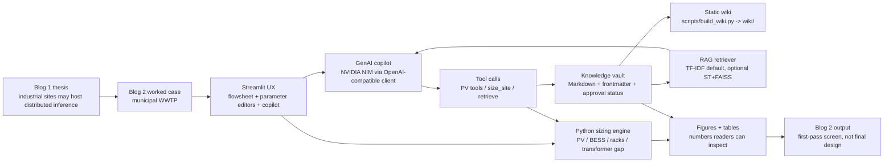

# EnergyFlux

<p align="center">
  
</p>

A worked first-pass sizing screen for distributed AI inference data centers at industrial host sites, with an engineer-governed knowledge base.

---

## What this repo demonstrates

- **First-pass sizing of distributed inference data centers at industrial sites.** PV nameplate, BESS energy, rack count, peak grid demand, and the transformer-upgrade gap, computed as one structured sizing pass.
- **WWTP as the worked example.** A mid-size municipal wastewater plant. Other host classes (chemical plants, distribution substations, institutional campuses) plug into the same design loop with per-host calibration.
- **GenAI-assisted behind-the-meter design.** A Streamlit flowsheet plus a sidebar copilot that retrieves cited assumptions instead of guessing from training-data recall.
- **Engineer-governed knowledge base.** Every cited page declares an approval status (Authoritative / Reviewed / Candidate / Legacy) and a scope (host type, region, equipment, voltage level). Unreviewed material is labeled "pending review" until a senior engineer signs off.

This is the companion repo to **[Blog 2](https://chennanli.github.io/EnergyFlux/posts/02-sizing-distributed-inference-data-centers/)** of the EnergyFlux series. Blog 1 proposed that some existing industrial sites already carry industrial land, megawatt-class service, and process water on the same parcel, and could shorten the path to distributed AI inference. Blog 2 turns that proposal into one worked sizing case.

---

## Architecture



---

## How the pieces fit

**Streamlit UX.** [`stage1_5_wwtp_dc/apps/blog2_flowsheet_app.py`](stage1_5_wwtp_dc/apps/blog2_flowsheet_app.py) and [`stage1_5_wwtp_dc/apps/blog2_genai_app_v2.py`](stage1_5_wwtp_dc/apps/blog2_genai_app_v2.py). A canvas of seven blocks (PV array, inverters, BESS, DC bus, AI racks, WWTP load, utility grid) with arrows carrying live kW values, plus a sidebar copilot. Click a block, edit a parameter, every downstream number recomputes.

**Python sizing engine.** [`stage1_5_wwtp_dc/design/sizing.py`](stage1_5_wwtp_dc/design/sizing.py), [`stage1_5_wwtp_dc/design/pv_tools.py`](stage1_5_wwtp_dc/design/pv_tools.py), [`stage1_5_wwtp_dc/design/archetypes.py`](stage1_5_wwtp_dc/design/archetypes.py). Pure-Python, pvlib/PVWatts-inspired first-pass sizing tables and rules: specific yield by tracker type at given latitude, rack-density lookups, BESS sizing rules, and a worst-case simultaneity check that flags the transformer-upgrade gap. No 8,760-hour simulation runs in this layer.

**GenAI copilot.** [`stage1_5_wwtp_dc/design/llm_v2.py`](stage1_5_wwtp_dc/design/llm_v2.py). NVIDIA NIM accessed through the OpenAI-compatible client, with a tool-calling loop that exposes the sizing engine plus a `retrieve` tool over the vault. The copilot writes no code — it asks tools for numbers and asks the vault for cited assumptions.

**Knowledge vault.** [`knowledge_vault/`](knowledge_vault/). Markdown pages with YAML frontmatter declaring approval status and scope. Promotion from Candidate to Reviewed happens through a Git pull request signed off by a senior engineer. The workflow is documented in [`knowledge_vault/AGENTS.md`](knowledge_vault/AGENTS.md).

**Static wiki.** [`wiki/`](wiki/), built from the vault by [`scripts/build_wiki.py`](scripts/build_wiki.py). Pure-Python static site, no Node toolchain, no build server. The same content the copilot retrieves is browsable as HTML.

**Public export.** This public repo is a curated release from the internal EnergyFlux workspace. It includes the Blog 2 demo code, the governed knowledge vault, the rendered wiki, and the scripts needed to rebuild the public artifacts. Drafts, private planning notes, and unfinished Blog 3 operation/dispatch code stay out of the public mirror.

---

## Run locally

```bash
pip install -r requirements.txt
export NVIDIA_API_KEY=<your_nvidia_api_key>
cd stage1_5_wwtp_dc
streamlit run apps/blog2_genai_app_v2.py
```

A free NVIDIA NIM key is available at [build.nvidia.com](https://build.nvidia.com). The flowsheet UI runs the same way:

```bash
streamlit run apps/blog2_flowsheet_app.py
```

## Run locally with Docker

Docker is optional. It is useful when you want to run the Blog 2 demo without
managing a local Python environment.

```bash
docker build -t energyflux-blog2 .
docker run --rm -p 8501:8501 -e NVIDIA_API_KEY=$NVIDIA_API_KEY energyflux-blog2
```

Or with Docker Compose:

```bash
docker compose up --build
```

Then open:

```text
http://localhost:8501
```

If `NVIDIA_API_KEY` is not set, the app still starts in mock / vault-only mode:
retrieval from the governed knowledge vault runs locally, but the live LLM
summarization step is skipped. The Docker image is a single Streamlit service;
it does not run a separate FastAPI backend, vector database, or MLflow server.
The image runs Streamlit as a non-root user and includes a healthcheck on the
Streamlit service endpoint.

---

## What this is not

- **Not a final design package.** First-pass sizing only. A site survey, utility coordination study, and permitting work are still required before any specific site can be built.
- **Not training-campus sizing.** The worked WWTP case sits in the few-MW range. Larger industrial hosts may have different MW envelopes and constraints, so the method transfers but the numbers do not.
- **Not a reviewed engineering standard yet.** The vault carries 30 pages today: 0 Reviewed, 14 Candidate, 16 Legacy. Every citation the copilot currently produces is labeled "pending review" until a senior engineer signs off.
- **Not dynamic dispatch or power-flow validation.** No 8,760-hour simulation, no MPC, no microgrid power-flow check. Those are future operations / dispatch / power-flow work, closer to Blog 3.

---

## Repo layout

```
EnergyFlux/
├── README.md
├── Dockerfile                    Optional one-container Streamlit run path
├── compose.yaml                  Optional Docker Compose wrapper
├── .dockerignore                 Keeps private/cache files out of Docker builds
├── index.html                    GitHub Pages landing page
├── stage1_5_wwtp_dc/             Blog 2 demo: apps + design + tests
├── knowledge_vault/              Engineer-governed knowledge base
├── wiki/                         Rendered HTML version of the vault
├── scripts/                      Wiki publisher + figure scripts
└── requirements.txt
```

---

## Links

- **Blog 1** — *[Turning industrial safety buffers into AI inference sites](https://chennanli.github.io/posts/01-ai-inference-buffers/)* (April 2026). Thesis post, no companion code.
- **Blog 2** — *[Sizing distributed AI inference data centers at industrial sites](https://chennanli.github.io/EnergyFlux/posts/02-sizing-distributed-inference-data-centers/)*.
- **Public wiki** — [chennanli.github.io/EnergyFlux/wiki/](https://chennanli.github.io/EnergyFlux/wiki/index.html)
- **Main app entry points** — [`stage1_5_wwtp_dc/apps/blog2_genai_app_v2.py`](stage1_5_wwtp_dc/apps/blog2_genai_app_v2.py) (chat copilot), [`stage1_5_wwtp_dc/apps/blog2_flowsheet_app.py`](stage1_5_wwtp_dc/apps/blog2_flowsheet_app.py) (flowsheet UI).

---

## Author

Chennan Li, PhD, PE.

## License

MIT
