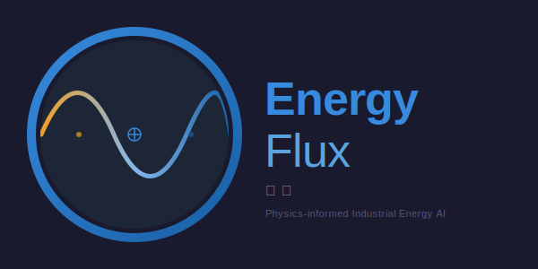

# EnergyFlux

<p align="center">
  
</p>

Notes on energy, AI infrastructure, and where they converge.

---

## Posts

- **Blog 1** — *[Turning industrial safety buffers into AI inference sites](https://chennanli.github.io/posts/01-ai-inference-buffers/)* (April 2026). Whether existing industrial setbacks could ease the AI infrastructure bottleneck. Thought piece — no companion code.
- **Blog 2** — *Sizing distributed AI inference data centers at industrial sites* (link when published). A demo flowsheet for first-pass sizing, with a copilot that retrieves from an engineer-governed knowledge base.

This repo holds the code, knowledge base, and rendered wiki that go with **Blog 2**.

---

## Blog 2 components

- Flowsheet UI — [`stage1_5_wwtp_dc/apps/blog2_flowsheet_app.py`](stage1_5_wwtp_dc/apps/blog2_flowsheet_app.py)
- Copilot chat — [`stage1_5_wwtp_dc/apps/blog2_genai_app_v2.py`](stage1_5_wwtp_dc/apps/blog2_genai_app_v2.py)
- Vault-backed retrieval — [`stage1_5_wwtp_dc/design/rag_v2.py`](stage1_5_wwtp_dc/design/rag_v2.py)
- LLM client — [`stage1_5_wwtp_dc/design/llm_v2.py`](stage1_5_wwtp_dc/design/llm_v2.py)
- Sizing math — [`stage1_5_wwtp_dc/design/`](stage1_5_wwtp_dc/design/)
- Knowledge base — [`knowledge_vault/`](knowledge_vault/)
- Wiki publisher — [`scripts/build_wiki.py`](scripts/build_wiki.py)
- Rendered wiki — [`wiki/index.html`](wiki/index.html)

```bash
cd stage1_5_wwtp_dc
streamlit run apps/blog2_genai_app_v2.py
```

The knowledge base has 30 pages so far. None has been reviewed yet, so the assistant labels every citation "pending review" until a senior engineer signs off. See [`knowledge_vault/AGENTS.md`](knowledge_vault/AGENTS.md) for the approval pattern.

---

## Repo layout

```
EnergyFlux/
├── README.md
├── stage1_5_wwtp_dc/         Blog 2 demo code
├── knowledge_vault/          Engineering knowledge base
├── wiki/                     Rendered HTML version of the vault
├── scripts/                  Wiki publisher + figure scripts
└── requirements.txt
```

---

## Author

Chennan Li, PhD, PE.

## License

MIT
